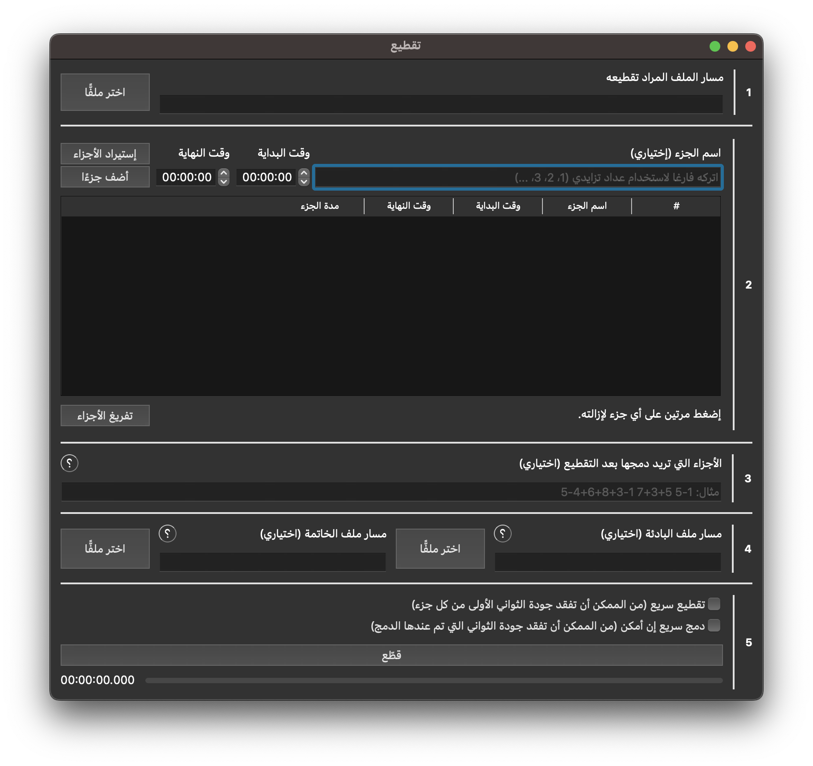

# تقطيع
يسعى برنامج تقطيع إلى تسهيل عملية معالجة المرئيات والصوتيات على الدعاة والعلماء أثناء تجهيز المواد الدعوية والعلمية.

## مميزات تقطيع
- تقطيع الصوتيات/المرئيات الطويلة إلى أجزاء متعددة بناءً على فترات زمنية محددة
- دمج الأجزاء التي تم تقطيعها
- دمج بادئة/خاتمة مع كل جزء تم تقطيعه

## مميزات نسعى لإضافتها

### مميزات جارٍ العمل عليها
- إستعراض الصوتيات/المرئيات قبل تقطيعها

### مميزات مستقبلية
- إختيار دقة مخرجات البرنامج
- تحويل المخرجات المرئية إلى مخرجات صوتية والعكس
- تضخيم/تقليل صوت المخرجات
- دمج صوتيات/مرئيات مقطعة مسبقًا
- تحسين جودة الصوت/الصورة
- تنزيل الملف من YouTube وتقطيعه
- تعتيم الأجزاء التي تحتوي على مشاهد غير لائقة
- إزالة السكتات والنفس
- تقطيع المدخلات تلقائيا بناءً على كلمات وجمل محددة
- تحويل الصوتيات إلى نصوص يمكن إضافتها إلى المخرجات
- إزالة الموسيقى من الصوتيات/المرئيات

## أنظمة التشغيل المدعومة

- Windows 10
- Windows 11
- Mac OS

## تنزيل البرنامج
يجب تثبيت برنامج FFmpeg على حاسبوك قبل استخدام "تقطيع".

### تثبيت برنامج FFmpeg على نظام تشغيل Windows
يمكنك اتباع الخطوات المذكورة [هنا](https://www.wikihow.com/Install-FFmpeg-on-Windows) أو [هنا](https://youtu.be/cuo2b39vYA0) لتثبيت البرنامج على نظام تشغيل Windows.

ملاحظة: يجب أن يكون إسم المجلد `ffmpeg`.

### تثبيت برنامج FFmpeg على نظام تشغيل Mac OS
يمكنك تثبيت البرنامج من خلال تنفيذ هذا الأمر: `brew install ffmpeg`.

### تنزيل برنامج تقطيع
يمكنك تنزيل برنامج تقطيع من أحد الروابط التالية وتشغيله بشكل مباشر على نظام تشغيلك:
- [نظام تشغيل Windows]()
- [نظام تشغيل Mac OS]()

ملاحظة: ستحتاج أحيانا إلى إجبار نظام تشغيلك على تشغيل البرنامج لأن المطوِّر (الكتب المُيسَّرة) غير موثوق عند أنظمة التشغيل بعد.

## البرمجيات والتقنيات المستخدمة لتطوير البرنامج
لتشغيل الشيفرة البرمجية، يجب تثبيت إطار عمل Qt6 من [هنا](https://doc.qt.io/qt-6/get-and-install-qt.html).

وفيما يتعلق بالبرمجيات:
- لغة البرمجة: C++ 17
- إطار العمل: Qt 6.4.0
- نظام البناء: CMake 3.25.2

## الدعم والتطوير
يمكنك مشاركتنا في تطوير هذا البرنامج وإضافة المميزات التي نسعى لاستكمالها من خلال تنزيل الشيفرة البرمجية الخاصة بالمستودع والبدأ بتحسينها والإضافة عليها.
